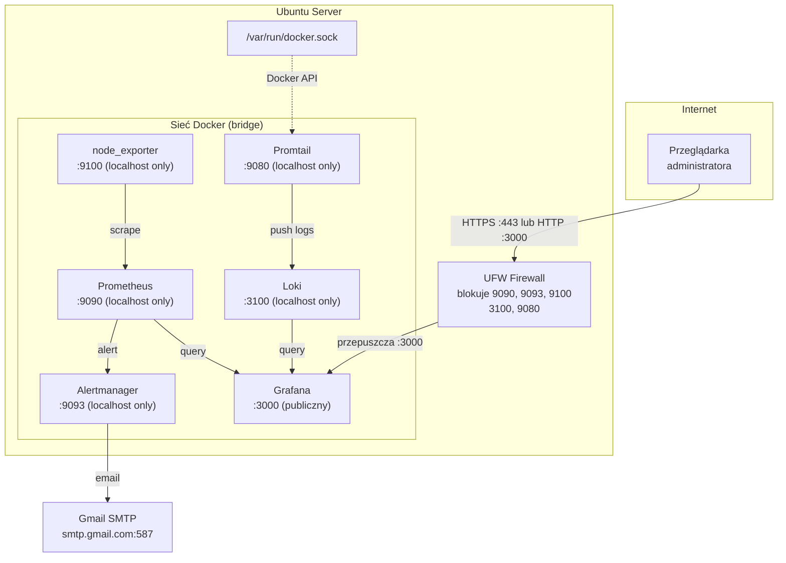

# Monitoring Stack — Wdrożenie On-Premises (Ubuntu Server)

Instrukcja wdrożenia stosu monitoringu na serwerze Ubuntu. W odróżnieniu od środowiska developerskiego na Windows/Docker Desktop, tutaj kontenery działają bezpośrednio na jądrze Linux — node_exporter zbiera prawdziwe metryki serwera, nie warstwy wirtualizacji.

---

## Architektura



**Kluczowa różnica od środowiska dev:** Wszystkie porty oprócz Grafany nasłuchują wyłącznie na `127.0.0.1` — są niedostępne z zewnątrz serwera. Prometheus, Alertmanager i Loki nie mają żadnego mechanizmu uwierzytelniania, więc nie mogą być wystawione na internet.

---

## Wymagania

- Ubuntu 22.04 LTS lub 24.04 LTS
- Minimum 2 vCPU, 2 GB RAM, 20 GB dysku
- Użytkownik z prawami `sudo`
- Port 3000 (Grafana) dostępny przez firewall (lub 443 przez reverse proxy)

---

## 1. Instalacja Docker CE

```bash
# Usuń stare wersje jeśli istnieją
sudo apt remove -y docker docker-engine docker.io containerd runc 2>/dev/null || true

# Dodaj oficjalne repozytorium Docker
sudo apt update
sudo apt install -y ca-certificates curl gnupg
sudo install -m 0755 -d /etc/apt/keyrings
curl -fsSL https://download.docker.com/linux/ubuntu/gpg \
  | sudo gpg --dearmor -o /etc/apt/keyrings/docker.gpg
sudo chmod a+r /etc/apt/keyrings/docker.gpg

echo "deb [arch=$(dpkg --print-architecture) signed-by=/etc/apt/keyrings/docker.gpg] \
  https://download.docker.com/linux/ubuntu $(. /etc/os-release && echo "$VERSION_CODENAME") stable" \
  | sudo tee /etc/apt/sources.list.d/docker.list > /dev/null

sudo apt update
sudo apt install -y docker-ce docker-ce-cli containerd.io docker-compose-plugin

# Dodaj użytkownika do grupy docker (bez sudo przy każdym poleceniu)
sudo usermod -aG docker $USER
newgrp docker

# Weryfikacja
docker --version
docker compose version
```

---

## 2. Pobranie repozytorium

```bash
sudo mkdir -p /opt/monitoring-stack
sudo chown $USER:$USER /opt/monitoring-stack
git clone https://github.com/jeti20/Monitoring-Stack-Prometheus-Grafana-Node-Exporter.git /opt/monitoring-stack
cd /opt/monitoring-stack
```

---

## 3. Setup — uprawnienia i sekrety

Uruchom skrypt setupowy — tworzy katalogi danych i ustawia właściciela zgodnie z UID jakim działają kontenery:

```bash
bash scripts/setup.sh
```

Skrypt wykonuje:
- `mkdir -p data/prometheus data/grafana data/loki`
- `chown 65534:65534 data/prometheus` — Prometheus działa jako UID 65534 (nobody)
- `chown 472:472 data/grafana` — Grafana działa jako UID 472
- `chown 10001:10001 data/loki` — Loki działa jako UID 10001
- `chmod 700 alertmanager/secrets`

**Dlaczego to ważne:** Na Linux Docker montuje katalogi hosta bezpośrednio. Jeśli katalog jest własnością `root` a kontener działa jako UID 472 (Grafana), zapis się nie powiedzie i kontener crashuje. Ustawienie prawidłowego właściciela rozwiązuje problem bez uruchamiania kontenerów jako root.

### Konfiguracja Gmail App Password

```bash
# Wygeneruj App Password: Google Account → Security → 2-Step Verification → App passwords
echo 'TWOJE_16_ZNAKOWE_HASLO' > alertmanager/secrets/gmail_password
chmod 600 alertmanager/secrets/gmail_password
```

### Konfiguracja adresów email

```bash
# Edytuj alertmanager/alertmanager.yml — ustaw adresy Gmail
nano alertmanager/alertmanager.yml
```

---

## 4. Firewall (UFW)

```bash
sudo ufw enable

# SSH — upewnij się że jest dozwolony przed włączeniem UFW
sudo ufw allow OpenSSH

# Grafana — jedyny serwis dostępny z zewnątrz
sudo ufw allow 3000/tcp

# Pozostałe porty nasłuchują tylko na 127.0.0.1 (docker-compose.yml)
# i są niedostępne z zewnątrz — nie wymagają reguł UFW

sudo ufw status verbose
```

**Uwaga:** Prometheus (:9090), Alertmanager (:9093), Loki (:3100), Promtail (:9080) i node_exporter (:9100) są związane z `127.0.0.1` w `docker-compose.yml`. Kontenery komunikują się między sobą przez wewnętrzną sieć Docker — firewall ich nie blokuje.

---

## 5. Uruchomienie stosu

```bash
cd /opt/monitoring-stack
docker compose up -d

# Sprawdź czy wszystkie kontenery są Running
docker compose ps

# Logi w razie problemów
docker compose logs -f
```

Weryfikacja dostępności:

```bash
# Grafana
curl -s http://localhost:3000/api/health | jq .

# Prometheus
curl -s http://localhost:9090/-/healthy

# Loki
curl -s http://localhost:3100/ready

# node_exporter
curl -s http://localhost:9100/metrics | head -5
```

---

## 6. Auto-start przez systemd

Skonfiguruj systemd żeby stos startował automatycznie po restarcie serwera:

```bash
sudo cp systemd/monitoring-stack.service /etc/systemd/system/
sudo systemctl daemon-reload
sudo systemctl enable monitoring-stack
sudo systemctl start monitoring-stack

# Sprawdź status
sudo systemctl status monitoring-stack
```

Po tym restarcie serwera (`sudo reboot`) stos wstaje automatycznie bez ingerencji.

---

## 7. Weryfikacja po starcie

| Serwis | URL | Domyślne dane |
|---|---|---|
| Grafana | `http://<IP_SERWERA>:3000` | admin / admin |
| Prometheus | `http://localhost:9090` | brak auth |
| Alertmanager | `http://localhost:9093` | brak auth |

Grafana przy pierwszym logowaniu poprosi o zmianę hasła — zrób to od razu.

W Grafanie sprawdź:
- **Dashboards → Node Exporter Full** — metryki CPU, RAM, dysk, sieć serwera
- **Dashboards → Loki Logs** — logi kontenerów Docker
- **Explore → Prometheus** → `up` — powinny być widoczne wszystkie targety ze statusem 1

---

## 8. Różnice względem środowiska developerskiego (Windows)

| Aspekt | Windows + Docker Desktop | Ubuntu On-Premises |
|---|---|---|
| node_exporter | metryki VM (WSL2/Hyper-V) | metryki prawdziwego serwera |
| Porty | wszystkie na `0.0.0.0` | tylko Grafana na `0.0.0.0` |
| restart | brak | `unless-stopped` — autostart po crashu |
| systemd | nie dotyczy | auto-start po restarcie OS |
| node_exporter pid | nie | `pid: host` — pełna widoczność procesów |
| Loki user | `user: root` | prawidłowy chown (UID 10001) |

---

## 9. Bezpieczeństwo

### Co jest zrobione

- Prometheus, Alertmanager, Loki, node_exporter nasłuchują tylko na `127.0.0.1` — niedostępne z internetu
- Hasło Gmail przechowywane w pliku z uprawnieniami `600`, nie w konfigu
- Kontenery danych (Prometheus, Grafana, Loki) działają jako non-root z właściwymi UID

### Co warto dodać w środowisku produkcyjnym

**Reverse proxy z HTTPS (nginx + Let's Encrypt):**

Grafana na porcie 3000 bez HTTPS to ryzyko — hasło idzie plaintext. W produkcji postaw nginx przed Grafaną:

```bash
sudo apt install -y nginx certbot python3-certbot-nginx
```

Przykładowa konfiguracja nginx `/etc/nginx/sites-available/grafana`:

```nginx
server {
    listen 443 ssl;
    server_name monitoring.twoja-domena.pl;

    ssl_certificate     /etc/letsencrypt/live/monitoring.twoja-domena.pl/fullchain.pem;
    ssl_certificate_key /etc/letsencrypt/live/monitoring.twoja-domena.pl/privkey.pem;

    location / {
        proxy_pass http://localhost:3000;
        proxy_set_header Host $host;
        proxy_set_header X-Real-IP $remote_addr;
    }
}

server {
    listen 80;
    server_name monitoring.twoja-domena.pl;
    return 301 https://$host$request_uri;
}
```

**Zmiana domyślnego hasła Grafany:**
Przy pierwszym logowaniu Grafana wymusza zmianę hasła. Ustaw silne hasło.

**Aktualizacje obrazów Docker:**
```bash
cd /opt/monitoring-stack
docker compose pull
docker compose up -d --remove-orphans
```

---

## 10. Troubleshooting

**Kontener nie startuje — problem z uprawnieniami:**
```bash
docker compose logs <nazwa_serwisu>
# Jeśli błąd "permission denied" na /prometheus, /loki itp.:
bash scripts/setup.sh
```

**Loki nie zapisuje danych:**
```bash
ls -la data/loki/
# Właściciel powinien być 10001
# Jeśli root: sudo chown -R 10001:10001 data/loki
```

**Promtail nie widzi logów Docker:**
```bash
# Sprawdź czy Docker socket jest dostępny
ls -la /var/run/docker.sock
# Właściciel: root:docker, uprawnienia: srw-rw----
# Użytkownik musi być w grupie docker lub promtail musi mieć dostęp do socketu
```

**Po restarcie serwera kontenery nie wstały:**
```bash
sudo systemctl status monitoring-stack
sudo journalctl -u monitoring-stack -n 50
```

**Port 3000 niedostępny z zewnątrz:**
```bash
sudo ufw status
# Sprawdź czy reguła dla 3000/tcp istnieje
sudo ufw allow 3000/tcp
```
