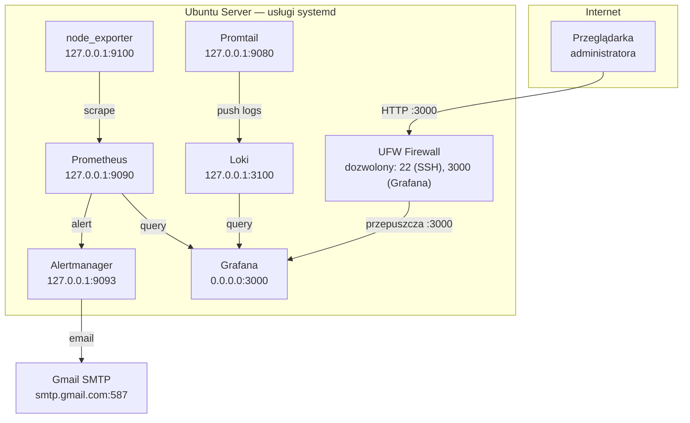

# Monitoring Stack — Wdrożenie On-Premises (Ubuntu Server)

Instrukcja wdrożenia stosu monitoringu na serwerze Ubuntu jako **natywne binarki działające pod systemd** — bez Dockera, bez kontenerów. Każda usługa działa bezpośrednio na kernelu Linuxa jako osobny serwis systemd z własnym użytkownikiem systemowym.

---

## Architektura



**Kluczowe założenie bezpieczeństwa:** Prometheus, Alertmanager, Node Exporter, Loki i Promtail nasłuchują wyłącznie na `127.0.0.1` — są niewidoczne z zewnątrz. Jedynym publicznie dostępnym serwisem jest Grafana na porcie 3000. Prometheus i Alertmanager nie mają wbudowanego mechanizmu uwierzytelniania — wystawienie ich na internet to poważna podatność.

---

## Wymagania

- Ubuntu 22.04 LTS lub 24.04 LTS
- Minimum 2 vCPU, 2 GB RAM, 20 GB dysku
- Użytkownik z prawami `sudo`
- Port 3000 (Grafana) dostępny przez firewall

---

## 1. Pobranie repozytorium

```bash
sudo mkdir -p /opt/monitoring-stack
sudo chown $USER:$USER /opt/monitoring-stack
git clone https://github.com/jeti20/Monitoring-Stack-Prometheus-Grafana-Node-Exporter.git /opt/monitoring-stack
cd /opt/monitoring-stack
git checkout onprem-ubuntu
```

---

## 2. Konfiguracja Gmail App Password

Przed uruchomieniem skryptu instalacyjnego przygotuj hasło aplikacji Gmail:

```bash
# Wygeneruj App Password: Google Account → Security → 2-Step Verification → App passwords
mkdir -p alertmanager/secrets
echo 'TWOJE_16_ZNAKOWE_HASLO' > alertmanager/secrets/gmail_password
chmod 600 alertmanager/secrets/gmail_password
```

Oraz ustaw adresy email w konfiguracji Alertmanagera:

```bash
nano alertmanager/alertmanager.yml
```

---

## 3. Firewall (UFW)

Skonfiguruj firewall **przed** instalacją, żeby nie zablokować się po włączeniu UFW:

```bash
sudo ufw enable

# SSH — krytyczne, bez tego stracisz dostęp
sudo ufw allow OpenSSH

# Grafana — jedyny serwis dostępny z zewnątrz
sudo ufw allow 3000/tcp

sudo ufw status verbose
```

Pozostałe serwisy (Prometheus :9090, Alertmanager :9093, Node Exporter :9100, Loki :3100) nasłuchują tylko na `127.0.0.1` — UFW ich nie dotyka, są niedostępne z sieci niezależnie od reguł.

---

## 4. Instalacja

Skrypt pobiera binarki, tworzy użytkowników systemowych, instaluje konfiguracje i uruchamia serwisy:

```bash
cd /opt/monitoring-stack
bash scripts/install.sh
```

Skrypt wykonuje kolejno:

1. **Grafana** — instalowana przez oficjalne repozytorium apt (stabilna, aktualizowana przez `apt upgrade`)
2. **Node Exporter** — binarka ze strony Prometheus, uruchamiana jako `node_exporter` (system user)
3. **Loki** — binarka z repozytorium Grafana, uruchamiana jako `loki` (system user)
4. **Prometheus** — binarka ze strony Prometheus, uruchamiana jako `prometheus` (system user)
5. **Alertmanager** — binarka ze strony Prometheus, uruchamiana jako `alertmanager` (system user)
6. **Promtail** — binarka z repozytorium Grafana, uruchamiana jako `promtail` (system user)

Wersje można nadpisać zmiennymi środowiskowymi przed wywołaniem:

```bash
PROMETHEUS_VERSION=3.4.0 LOKI_VERSION=3.5.0 bash scripts/install.sh
```

---

## 5. Weryfikacja po instalacji

```bash
# Status wszystkich serwisów
systemctl status prometheus alertmanager node_exporter loki promtail grafana-server

# Szybki test dostępności (wszystko przez localhost)
curl -s http://localhost:9090/-/healthy    # Prometheus
curl -s http://localhost:9093/-/healthy    # Alertmanager
curl -s http://localhost:9100/metrics | head -3  # Node Exporter
curl -s http://localhost:3100/ready       # Loki
curl -s http://localhost:3000/api/health  # Grafana
```

| Serwis | URL dostępny lokalnie | Zewnętrznie |
|---|---|---|
| Grafana | `http://localhost:3000` | `http://<IP_SERWERA>:3000` |
| Prometheus | `http://localhost:9090` | niedostępny |
| Alertmanager | `http://localhost:9093` | niedostępny |
| Node Exporter | `http://localhost:9100` | niedostępny |

Grafana przy pierwszym logowaniu (`admin` / `admin`) wymusi zmianę hasła — zrób to od razu.

W Grafanie sprawdź:
- **Dashboards → Node Exporter Full** — metryki CPU, RAM, dysk, sieć serwera
- **Dashboards → Loki Logs** — logi systemowe i serwisów (z journald)
- **Explore → Prometheus** → `up` — wszystkie targety ze statusem 1

---

## 6. Lokalizacja plików

| Komponent | Konfiguracja | Dane |
|---|---|---|
| Prometheus | `/etc/prometheus/` | `/var/lib/prometheus/` |
| Alertmanager | `/etc/alertmanager/` | `/var/lib/alertmanager/` |
| Node Exporter | — | — |
| Loki | `/etc/loki/` | `/var/lib/loki/` |
| Promtail | `/etc/promtail/` | `/var/lib/promtail/` |
| Grafana | `/etc/grafana/` | `/var/lib/grafana/` |

Hasło Gmail: `/etc/alertmanager/secrets/gmail_password` (uprawnienia `600`, właściciel `alertmanager`)

---

## 7. Zarządzanie serwisami

```bash
# Restart po zmianie konfiguracji
sudo systemctl restart prometheus
sudo systemctl restart alertmanager
sudo systemctl restart grafana-server

# Reload konfiguracji bez restartu (tam gdzie wspierany)
sudo systemctl reload prometheus   # działa — Prometheus obsługuje SIGHUP
sudo systemctl reload alertmanager # działa — Alertmanager obsługuje SIGHUP

# Logi serwisu
sudo journalctl -u prometheus -f
sudo journalctl -u loki -n 100

# Wszystkie serwisy startują automatycznie po restarcie OS (enabled przez install.sh)
sudo reboot
```

---

## 8. Bezpieczeństwo

### Co jest zrobione

- Wszystkie serwisy poza Grafaną nasłuchują tylko na `127.0.0.1`
- Każda usługa działa jako dedykowany użytkownik systemowy bez powłoki (`/usr/sbin/nologin`)
- Hasło Gmail w osobnym pliku z uprawnieniami `600`
- UFW blokuje wszystkie porty poza 22 i 3000

### Co warto dodać w środowisku produkcyjnym

**Reverse proxy z HTTPS (nginx + Let's Encrypt):**

Grafana na HTTP :3000 przesyła hasło w plaintext. W produkcji postaw nginx:

```bash
sudo apt install -y nginx certbot python3-certbot-nginx
sudo certbot --nginx -d monitoring.twoja-domena.pl
```

Konfiguracja nginx `/etc/nginx/sites-available/grafana`:

```nginx
server {
    listen 443 ssl;
    server_name monitoring.twoja-domena.pl;

    ssl_certificate     /etc/letsencrypt/live/monitoring.twoja-domena.pl/fullchain.pem;
    ssl_certificate_key /etc/letsencrypt/live/monitoring.twoja-domena.pl/privkey.pem;

    location / {
        proxy_pass http://localhost:3000;
        proxy_set_header Host $host;
        proxy_set_header X-Real-IP $remote_addr;
    }
}

server {
    listen 80;
    server_name monitoring.twoja-domena.pl;
    return 301 https://$host$request_uri;
}
```

Po konfiguracji nginx usuń regułę UFW dla portu 3000 i dodaj 443:

```bash
sudo ufw delete allow 3000/tcp
sudo ufw allow 443/tcp
sudo ufw allow 80/tcp
```

**Aktualizacje binarkowe:**

```bash
# Przeinstaluj konkretny komponent w nowej wersji
PROMETHEUS_VERSION=3.5.0 bash scripts/install.sh
```

Grafana aktualizuje się przez apt:

```bash
sudo apt update && sudo apt upgrade grafana
```

---

## 9. Troubleshooting

**Serwis nie startuje:**
```bash
sudo journalctl -u prometheus -n 50
sudo systemctl status prometheus
```

**Błąd uprawnień do katalogu danych:**
```bash
# Przykład dla Loki — sprawdź właściciela
ls -la /var/lib/loki/
# Powinien być: loki:loki
sudo chown -R loki:loki /var/lib/loki
```

**Promtail nie czyta journald:**
```bash
# Sprawdź czy promtail jest w grupie systemd-journal
id promtail
# Jeśli brak — dodaj i zrestartuj
sudo usermod -aG systemd-journal promtail
sudo systemctl restart promtail
```

**Port 3000 niedostępny z zewnątrz:**
```bash
sudo ufw status
# Jeśli brak reguły:
sudo ufw allow 3000/tcp
```

**Grafana nie łączy się z Prometheus/Loki:**
```bash
# Sprawdź czy serwisy działają i odpowiadają lokalnie
curl http://localhost:9090/-/healthy
curl http://localhost:3100/ready
# Jeśli nie — sprawdź logi serwisu
sudo journalctl -u prometheus -n 20
sudo journalctl -u loki -n 20
```

---

## 10. Różnice względem środowiska developerskiego (Docker na Windows)

| Aspekt | Windows + Docker Desktop | Ubuntu On-Premises (natywny) |
|---|---|---|
| Uruchomienie | `docker compose up -d` | `bash scripts/install.sh` + systemd |
| node_exporter | metryki VM (WSL2/Hyper-V) | metryki prawdziwego serwera |
| Adresy usług | nazwy kontenerów (`prometheus:9090`) | `localhost:9090` |
| Logi kontenerów | Promtail + docker_sd_configs | journald (systemd units) |
| Auto-start | brak | systemd `enable` — startuje po restarcie OS |
| Aktualizacje | `docker compose pull` | `apt upgrade grafana` + ponowna instalacja binarek |
| Izolacja procesów | Docker namespace | systemowy użytkownik (`--shell /usr/sbin/nologin`) |
