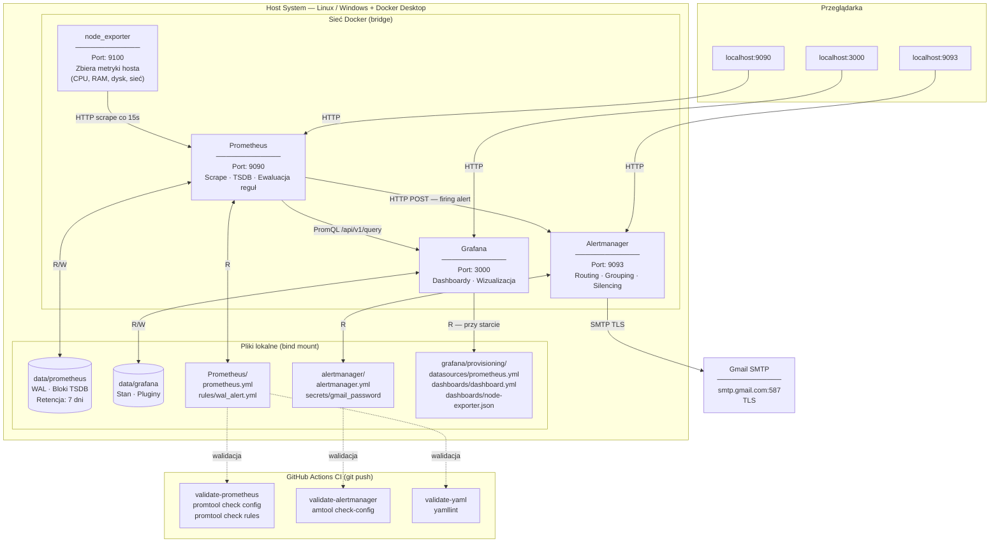

# Monitoring Stack — Prometheus + Grafana + Node Exporter + Alertmanager

## Stos

| Serwis | Port | Opis |
|---|---|---|
| node_exporter | 9100 | zbiera metryki systemu (CPU, RAM, dysk, sieć) |
| prometheus | 9090 | scrape metryk, przechowywanie TSDB, ewaluacja reguł alertów |
| grafana | 3000 | wizualizacja |
| alertmanager | 9093 | odbiera alerty od Prometheusa, wysyła powiadomienia (email) |

---

## Architektura



---

## Uruchamianie

```bash
docker compose up -d
docker compose down
```

---

## Struktura projektu

```
.
├── docker-compose.yml
├── .env                          # zmienne środowiskowe (w .gitignore — nie trafia do gita)
├── .gitignore
├── Prometheus/
│   ├── prometheus.yml            # konfiguracja Prometheusa (scrape, alerting, rule_files)
│   └── rules/
│       └── wal_alert.yml         # reguły alertów
├── alertmanager/
│   ├── alertmanager.yml          # konfiguracja Alertmanagera (receiver, smtp)
│   └── secrets/
│       └── gmail_password        # hasło App Password (w .gitignore — nie trafia do gita)
├── grafana/
│   └── provisioning/
│       ├── datasources/
│       │   └── prometheus.yml    # automatyczna konfiguracja datasource Prometheusa
│       └── dashboards/
│           ├── dashboard.yml     # mówi Grafanie gdzie szukać plików JSON z dashboardami
│           └── node-exporter.json # dashboard Node Exporter Full (ID: 1860 z grafana.com)
└── data/
    ├── prometheus/               # dane TSDB Prometheusa (bind mount)
    └── grafana/                  # stan Grafany — pluginy, sesje (bind mount)
```

### Za co odpowiada każdy plik

**`docker-compose.yml`** — definicja całego stosu: obrazy, porty, volumes, komendy startowe wszystkich kontenerów.

**`.env`** — zmienne środowiskowe używane przez Docker Compose (np. adresy email). Plik lokalny, nigdy nie trafia do repozytorium.

**`Prometheus/prometheus.yml`** — główny config Prometheusa:
- `scrape_configs` — skąd zbierać metryki (node_exporter, sam Prometheus)
- `alerting` — adres Alertmanagera, do którego wysyłane są alerty
- `rule_files` — ścieżka do plików z regułami alertów

**`Prometheus/rules/wal_alert.yml`** — plik z regułami alertów. Prometheus ewaluuje go co `evaluation_interval` (15s). Zawiera alert `WalSizeExceeded` który odpala się gdy WAL przekroczy 1MB przez co najmniej 1 minutę.

**`alertmanager/alertmanager.yml`** — konfiguracja Alertmanagera: do kogo wysłać alert (receiver) i jaką metodą (email przez SMTP Gmail). Hasło nie jest tu wpisane na sztywno — Alertmanager czyta je z pliku przez `auth_password_file`.

**`alertmanager/secrets/gmail_password`** — plik zawierający wyłącznie App Password do Gmaila. Plik lokalny, nigdy nie trafia do repozytorium. Alertmanager czyta go przy każdym wysyłaniu emaila.

**`grafana/provisioning/datasources/prometheus.yml`** — Grafana czyta ten plik przy starcie i automatycznie dodaje Prometheusa jako datasource. Bez tego trzeba by klikać ręcznie w UI po każdym `docker compose up`.

**`grafana/provisioning/dashboards/dashboard.yml`** — mówi Grafanie żeby szukała plików JSON z dashboardami w folderze `/etc/grafana/provisioning/dashboards/`. Grafana wczytuje je automatycznie przy starcie.

**`grafana/provisioning/dashboards/node-exporter.json`** — definicja dashboardu Node Exporter Full (ID: 1860 z grafana.com). Pobrana przez API: `https://grafana.com/api/dashboards/1860/revisions/latest/download`. Zawiera panele CPU, RAM, dysk, sieć.

---

## Grafana Provisioning

Provisioning = konfiguracja Grafany jako kod. Zamiast klikać w UI, Grafana przy starcie automatycznie wczytuje pliki z `/etc/grafana/provisioning/` i konfiguruje się sama.

```
grafana/provisioning/               (host)
        ↕ bind mount
/etc/grafana/provisioning/          (kontener)
├── datasources/
│   └── prometheus.yml   ←  Grafana czyta przy starcie → dodaje datasource Prometheus
└── dashboards/
    ├── dashboard.yml    ←  Grafana czyta przy starcie → wie gdzie szukać JSON-ów
    └── node-exporter.json  ←  Grafana wczytuje → dashboard pojawia się automatycznie
```

Grafana wie o tej ścieżce bo jest ona zakodowana na sztywno w obrazie `grafana/grafana` w pliku `grafana.ini`:
```ini
[paths]
provisioning = /etc/grafana/provisioning
```
Nie konfigurujesz tego nigdzie — Grafana zawsze sprawdza tę ścieżkę przy starcie. Ty tylko dajesz jej tam swoje pliki przez bind mount w `docker-compose.yml`.

**Kolejność wczytywania przy starcie Grafany:**
1. Wczytuje `datasources/prometheus.yml` → rejestruje Prometheusa jako datasource o nazwie `Prometheus`
2. Wczytuje `dashboards/dashboard.yml` → dowiaduje się że ma szukać JSON-ów w tym samym folderze
3. Wczytuje `dashboards/node-exporter.json` → ładuje dashboard Node Exporter Full

Dashboardy załadowane przez provisioning są **read-only w UI** — nie można ich edytować przez przeglądarkę. Zmiany wprowadza się przez edycję pliku JSON i restart kontenera.

---

## Persystencja danych (volumes)

Kontenery są efemeryczne - bez volumes dane znikają po restarcie. Używamy **bind mountów** (ścieżki względne), dzięki czemu dane lądują bezpośrednio w folderze projektu.

```yaml
volumes:
  - ./data/prometheus:/prometheus
  - ./data/grafana:/var/lib/grafana
```

Alternatywa: named volumes (`prometheus_data:/prometheus`) - Docker zarządza lokalizacją sam, dane lądują w:
- Windows: wewnątrz WSL2/Hyper-V VM (`\\wsl$\docker-desktop-data\data\docker\volumes\`)
- Linux: `/var/lib/docker/volumes/`

Bind mounty są czytelniejsze i łatwiejsze do backupu.

---

## Sieć między kontenerami

Docker Compose tworzy wspólną sieć dla wszystkich serwisów. Kontenery komunikują się przez **nazwę serwisu**, nie przez `localhost`.

```
# ŹLE - localhost to sam kontener Grafany
http://localhost:9090

# DOBRZE - Docker DNS rozwiązuje nazwę serwisu
http://prometheus:9090

# lub przez hostname jeśli ustawiony
http://prometheus.test:9090
```

Każdy kontener ma własny, izolowany stos sieciowy. `localhost` wewnątrz kontenera wskazuje na ten sam kontener.

---

## Jak Prometheus przechowuje dane (TSDB)

Prometheus używa własnej bazy szeregów czasowych (TSDB - Time Series Database). Dane w `./data/prometheus/`:

```
data/prometheus/
├── wal/               # Write-Ahead Log - świeże metryki trafiają tutaj
│   ├── 00000000
│   └── 00000001
├── lock               # plik blokady (jeden proces na raz)
├── queries.active     # aktualnie wykonywane zapytania
└── 01ABCDEF.../       # skompaktowane bloki historyczne (po ~2h)
```

**WAL (Write-Ahead Log):**
Wszystkie nowe metryki trafiają najpierw do WAL. Jest to bufor zapisu - szybki, append-only. Po około 2 godzinach Prometheus kompaktuje dane z WAL do bloków i czyści WAL.

**Bloki:**
Niezmienne, skompaktowane fragmenty danych historycznych. Pojawiają się dopiero po ~2 godzinach działania. `prometheus_tsdb_storage_blocks_bytes` pokazuje 0 dopóki pierwszy blok nie powstanie.

**Baza jest append-only** - nie edytujesz istniejących danych. Możesz tylko usuwać serie przez API:
```
POST http://localhost:9090/api/v1/admin/tsdb/delete_series?match[]=nazwa_metryki
```

---

## Seria vs metryka (Cardinality)

**Seria** = unikalna kombinacja nazwy metryki + wszystkich labelów:

```
node_cpu_seconds_total{cpu="0", mode="idle"}   # seria 1
node_cpu_seconds_total{cpu="0", mode="user"}   # seria 2
node_cpu_seconds_total{cpu="1", mode="idle"}   # seria 3
```

To są 3 serie tej samej metryki `node_cpu_seconds_total`.

**Cardinality** = łączna liczba unikalnych serii. Każda seria zajmuje RAM. Wysoka cardinality (miliony serii) to główna przyczyna problemów wydajnościowych Prometheusa.

Zły wzorzec (eksplodująca cardinality):
```
http_requests_total{user_id="12345"}  # każdy user = nowa seria
```

Dobry wzorzec:
```
http_requests_total{endpoint="/api", method="GET"}
```

---

## Retencja

Ustawiana flagą startową w `docker-compose.yml`:

```yaml
command:
  - '--config.file=/etc/prometheus/prometheus.yml'
  - '--storage.tsdb.retention.time=7d'
```

Domyślna retencja: 15 dni. Po upływie czasu stare bloki są automatycznie usuwane.

---

## Przydatne metryki w PromQL

```promql
# Rozmiar bazy (bloki)
prometheus_tsdb_storage_blocks_bytes

# Rozmiar WAL
prometheus_tsdb_wal_storage_size_bytes

# Aktualna liczba aktywnych serii
prometheus_tsdb_head_series

# Łącznie serii od startu (counter, tylko rośnie)
prometheus_tsdb_head_series_created_total

# Top 10 metryk z największą liczbą serii
topk(10, count by (__name__)({__name__=~".+"}))

# Status targetów
up
```

UI Prometheusa: `http://localhost:9090`
TSDB Status: `http://localhost:9090/tsdb-status`

---

## Node Exporter - co zbiera i gdzie

Node Exporter zbiera metryki systemu Linux przez wirtualne systemy plików:

```yaml
volumes:
  - /proc:/host/proc:ro   # procesy, CPU, pamięć
  - /sys:/host/sys:ro     # urządzenia, sieć
  - /:/rootfs:ro          # dyski
command:
  - '--path.procfs=/host/proc'
  - '--path.sysfs=/host/sys'
  - '--path.rootfs=/rootfs'
  - '--collector.filesystem.mount-points-exclude=^/(sys|proc|dev|host|etc)($$|/)'
```

**Na serwerze Linux:** zbiera metryki prawdziwego hosta - działa natywnie.

**Na Windows z Docker Desktop:** zbiera metryki **maszyny wirtualnej** (WSL2 lub Hyper-V), nie samego Windowsa. Wynika to z architektury Docker na Windows:

```
┌─────────────────────────────────────────────────┐
│                  Windows 11                     │
│                                                 │
│  ┌──────────────────────────────────────────┐  │
│  │         Linux VM (WSL2 / Hyper-V)        │  │
│  │                                          │  │
│  │  ┌──────────┐ ┌──────────┐ ┌──────────┐ │  │
│  │  │  Grafana │ │Prometheus│ │  node    │ │  │
│  │  │ kontener │ │ kontener │ │ exporter │ │  │
│  │  └──────────┘ └──────────┘ └──────────┘ │  │
│  └──────────────────────────────────────────┘  │
└─────────────────────────────────────────────────┘
```

Kontenery to technologia Linuxowa (`namespaces`, `cgroups`). Na Windows Docker Desktop uruchamia jedną ukrytą VM z Linuxem - wszystkie kontenery działają w tej jednej VM, nie bezpośrednio na Windows.

Do monitorowania hosta Windows potrzebny jest **windows_exporter**:
```powershell
winget install prometheus-community.windows_exporter
```

---

## Instalacja na serwerze Ubuntu

```bash
curl -fsSL https://get.docker.com | sh
docker --version
docker compose version
```

Na Linux nie ma pośredniej VM — Docker Engine działa bezpośrednio na jądrze hosta. Node Exporter zbiera wtedy prawdziwe metryki serwera.

---

## Alertmanager — jak działa

Alertmanager jest osobnym procesem od Prometheusa. Podział odpowiedzialności:

- **Prometheus** — ewaluuje reguły i decyduje czy alert jest aktywny
- **Alertmanager** — odbiera aktywne alerty i decyduje co z nimi zrobić (email, Slack, silence, grupowanie)

```
wal_alert.yml         Prometheus           Alertmanager        Gmail
─────────────         ──────────           ────────────        ─────
expr > 1MB  ──▶  ewaluuje co 15s  ──▶  odbiera alert  ──▶  wysyła email
for: 1m          jeśli spełniony
                 przez 1 min →
                 wysyła do :9093
```

Grafana również pokazuje alerty — odpytuje bezpośrednio Prometheusa przez `/api/v1/alerts`, nie przez Alertmanagera.

UI Alertmanagera: `http://localhost:9093`

---

## Reguły alertów (PromQL)

Prometheus wie o regułach dzięki sekcji `rule_files` w `prometheus.yml`:

```yaml
rule_files:
  - "rules/*.yml"
```

To glob pattern — Prometheus wczytuje wszystkie pliki `.yml` z folderu `rules/` i ewaluuje je co `evaluation_interval` (15s). Każdy plik może zawierać wiele grup reguł. Prometheus rozróżnia typ reguły po słowie kluczowym: `alert:` = reguła alertu, `record:` = recording rule (gotowe zapytanie zapisane jako nowa metryka).

Plik `Prometheus/rules/wal_alert.yml`:

```yaml
groups:
  - name: prometheus_wal
    rules:
      - alert: WalSizeExceeded
        expr: prometheus_tsdb_wal_storage_size_bytes > 1048576
        for: 1m
        labels:
          severity: warning
        annotations:
          summary: "WAL Prometheusa przekroczył 1MB"
          description: "Aktualny rozmiar WAL: {{ $value | humanize1024 }}B"
```

- `expr` — warunek w PromQL (1048576 = 1MB w bajtach)
- `for: 1m` — warunek musi być spełniony nieprzerwanie przez 1 minutę zanim alert przejdzie w stan FIRING
- `labels` — metadane alertu (np. severity używany do routingu w Alertmanagerze)
- `annotations` — opis alertu widoczny w emailu/UI. `humanize1024` formatuje bajty na czytelną postać (np. `1.2 Mi`)

Stany alertu w Prometheusie:
- **inactive** — warunek nie jest spełniony
- **pending** — warunek spełniony, ale jeszcze nie minął czas `for`
- **firing** — alert aktywny, Prometheus wysyła do Alertmanagera

---

## Zarządzanie sekretami

Hasła i dane wrażliwe nigdy nie trafiają do repozytorium. Stosowane podejście:

**`auth_password_file`** — wbudowana funkcja Alertmanagera. Zamiast wpisywać hasło w configu, podajesz ścieżkę do pliku który zawiera wyłącznie hasło:

```yaml
# alertmanager.yml
auth_password_file: "/etc/alertmanager/secrets/gmail_password"
```

Plik `alertmanager/secrets/gmail_password` jest wykluczony z gita przez `.gitignore`. Na nowym serwerze tworzysz go ręcznie.

**Dlaczego nie zmienne środowiskowe `${VAR}` w alertmanager.yml?**
Alertmanager nie obsługuje natywnie podstawiania zmiennych środowiskowych w pliku konfiguracyjnym — `${VAR}` jest traktowane jako tekst dosłowny. Dlatego używamy `auth_password_file`.

**App Password Gmail** — zamiast hasła do konta Google, generujesz dedykowane hasło aplikacji:
`Konto Google → Zabezpieczenia → Weryfikacja dwuetapowa → Hasła do aplikacji`
Wygenerowane 16-znakowe hasło wklejasz do pliku `alertmanager/secrets/gmail_password`.

---

## CI/CD — GitHub Actions

### Co to jest GitHub Actions?

GitHub Actions to system CI/CD wbudowany bezpośrednio w GitHub — nie musisz stawiać żadnego dodatkowego serwera (jak Jenkins). Konfiguracja jest plikiem YAML w repozytorium: `.github/workflows/ci.yml`.

Gdy robisz `git push`, GitHub automatycznie:
1. Uruchamia wirtualną maszynę z Ubuntu na swoich serwerach (tzw. **runner**)
2. Pobiera kod z repozytorium
3. Wykonuje zdefiniowane przez Ciebie kroki
4. Zwraca wynik — zielony ptaszek lub czerwony X

Wyniki widzisz w zakładce **Actions** na stronie repo w GitHub.

---

### Jak zbudowany jest nasz workflow

Plik `.github/workflows/ci.yml` definiuje **3 niezależne joby** które działają **równolegle** przy każdym pushu:

```
git push
    ↓
┌─────────────────────┐  ┌──────────────────────┐  ┌─────────────────┐
│ validate-prometheus │  │ validate-alertmanager │  │  validate-yaml  │
│                     │  │                       │  │                 │
│ promtool check      │  │ amtool check-config   │  │ yamllint        │
│   config            │  │   alertmanager.yml    │  │   wszystkie     │
│ promtool check      │  │                       │  │   pliki YAML    │
│   rules             │  │                       │  │                 │
└─────────────────────┘  └──────────────────────┘  └─────────────────┘
         ↓                          ↓                        ↓
      ✓ / ✗                      ✓ / ✗                    ✓ / ✗
```

Joby są od siebie niezależne — działają równolegle, co skraca czas wykonania. Gdy jeden failuje, od razu wiesz który komponent ma problem.

---

### Podstawowa struktura workflow

```yaml
name: CI                        # nazwa wyświetlana w zakładce Actions

on: [push, pull_request]        # kiedy się uruchamia — przy każdym pushu i PR

jobs:
  validate-prometheus:          # nazwa jobu
    runs-on: ubuntu-latest      # GitHub daje VM z Ubuntu

    steps:
      - uses: actions/checkout@v5   # pobiera kod repo na VM (gotowa akcja z marketplace)
      - run: promtool check config  # Twoja komenda
```

**`uses`** — gotowa akcja z GitHub Marketplace. `actions/checkout` to oficjalna akcja która klonuje repozytorium na VM runnera. Bez tego kroku VM nie miałaby dostępu do Twoich plików.

**`run`** — zwykła komenda shell którą wykonuje VM.

---

### Co sprawdza każdy job

**`validate-prometheus`**
- `promtool check config Prometheus/prometheus.yml` — sprawdza czy główny config Prometheusa jest poprawny (składnia, referencje do plików reguł)
- `promtool check rules Prometheus/rules/*.yml` — sprawdza składnię reguł alertów (PromQL, wymagane pola)

**`validate-alertmanager`**
- `amtool check-config alertmanager/alertmanager.yml` — sprawdza poprawność konfiguracji Alertmanagera (routing, receivers)

**`validate-yaml`**
- `yamllint` — sprawdza składnię YAML wszystkich plików konfiguracyjnych (wcięcia, cudzysłowy, brakujące `---`)

---

### Dlaczego to ważne?

Bez CI możesz przypadkowo wypchnąć błędny plik i położyć działający stos. Przykład:

```yaml
# literówka w prometheus.yml
scrape_interval: 15s
evaluaton_interval: 15s   # błąd — Prometheus nie wystartuje
```

CI wykryje to **zanim** trafi na serwer — push zostanie oznaczony jako failed i wiesz że coś jest nie tak.
